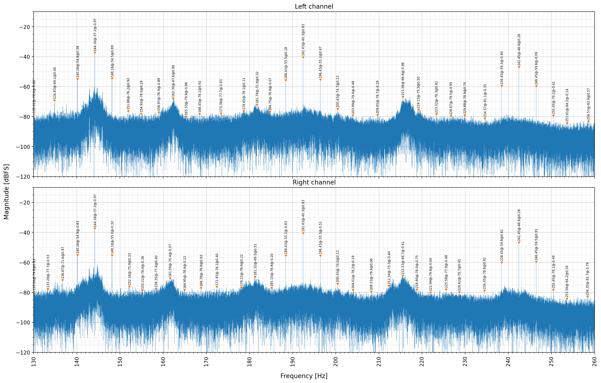

# Audio Spectrum Analyzer

A tool for precise visualization and analysis of frequencies and phases in audio signals. Originally developed to identify and measure brainwave entrainment signals used in various audio programs.

## What it can detect

- Binaural beat frequencies
- Tone spatial angle modulation (type and frequency)
- Tone panning
- Monaural beats
- Isochronic tones
- Certain background noise effects

## Requirements

Python 3.10+ is required. Install dependencies with:

```bash
pip install -r requirements.txt
```

Then launch the notebook:

```bash
pip install jupyterlab
jupyter lab
```

## Getting started

Use [analyzer.ipynb](analyzer.ipynb) as a starting point.

### Example visualizations

Spectrogram


Spectrum


## Tips for best results

**Choose a stationary interval** — analysis accuracy depends on the signal being spectrally stable throughout the selected window. Avoid sections with fades, transitions, or varying effects.

**Longer intervals give better results** — a longer window increases frequency resolution and lowers the noise floor. A tone buried in noise can often still be measured accurately if the interval is long enough.

**Memory and performance** — analysis of long intervals is slow and memory-intensive. That said, the tool can handle files multi-hours long, which enables an extremely low noise floor and highly precise frequency measurements.